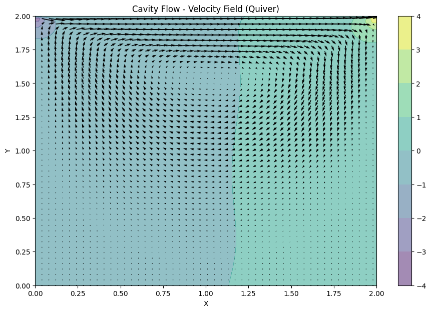
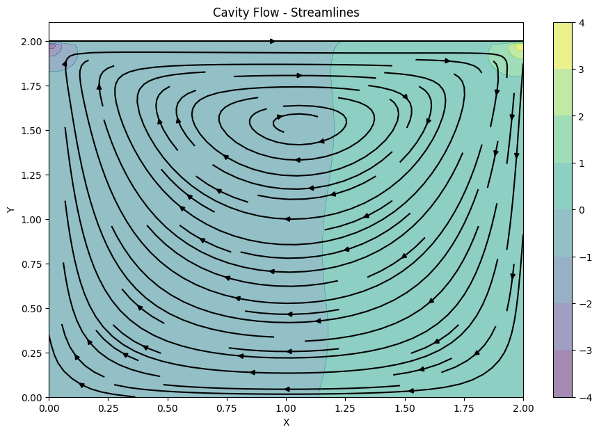
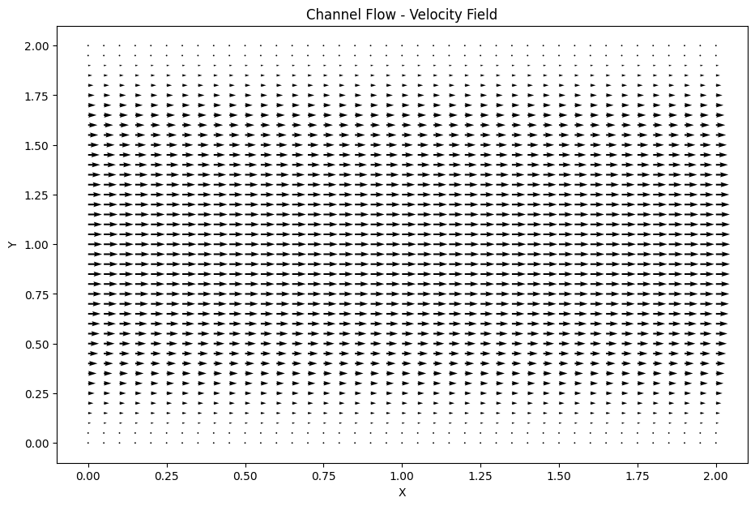
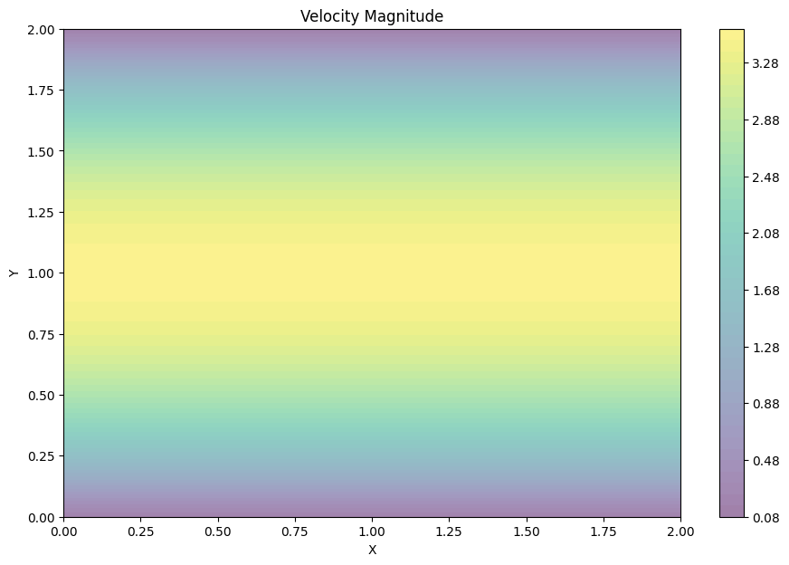
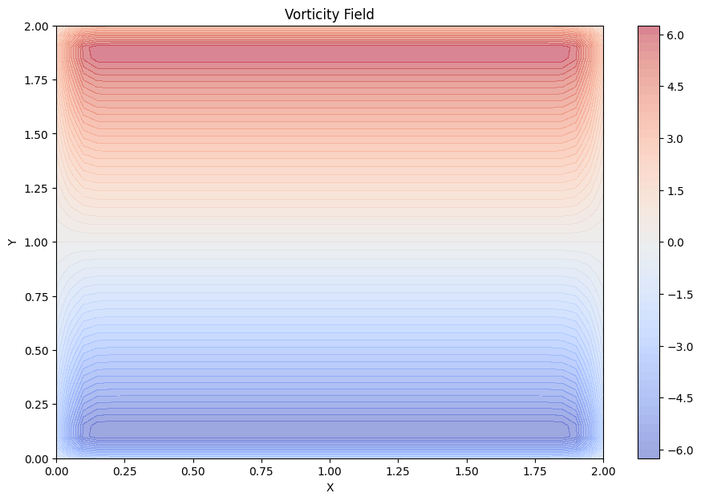
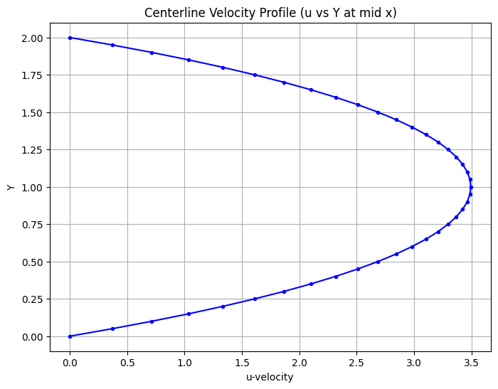

# Basic Flows: CFD Simulations in Python

This folder contains two classic CFD flow problems implemented using **finite difference methods in Python**. These examples are foundational and serve as a base for learning numerical simulation, and understanding flow physics.

---

## Included Problems

### 1. Lid-Driven Cavity Flow (`cavityFlow.py`)
- Solves the **incompressible Navier–Stokes equations** in a 2D square cavity.
- The top wall (lid) moves with a constant velocity, inducing vortices in the domain.
- Implements a pressure Poisson equation with Dirichlet and Neumann boundary conditions.
- Uses fixed grid size (default 100×100) and time-stepping.
- **Post-processing includes:**
  - Quiver plots of the velocity field
  - Streamline plots

### 2. Channel Flow (`channelFlow.py`)
- Simulates pressure-driven flow between two horizontal plates with **periodic boundary conditions** in the streamwise direction.
- Solves the **incompressible Navier–Stokes equations** using finite differences.
- Includes internal loop convergence check (velocity change tolerance).
- **Post-processing includes:**
  - Contour plots of smoothed velocity and vorticity fields
  - Centerline velocity profile (u vs y)

---

## How to Run

### 1️⃣ Set Up the Python Environment

Navigate to this folder and run the following:

```bash
# Create virtual environment (optional but recommended)
python -m venv env

# Activate environment
# On Windows:
env\Scripts\activate
# On macOS/Linux:
source env/bin/activate

# Install required packages
pip install -r requirements.txt
```

---

### 2️⃣ Run the Simulations

```bash
# For lid-driven cavity flow
python cavityFlow.py

# For channel flow with post-processing
python channelFlow.py
```

---

## Results and Discussion

### Lid-Driven Cavity Flow

| Visualization Type     | Output Image                                |
|------------------------|---------------------------------------------|
<<<<<<< HEAD
| Velocity Field (Quiver)|  | | Streamlines            |  |

=======
| Velocity Field (Quiver)|  |
| Streamlines            |  |
>>>>>>> 00d06c0 (Update image sizing in README using HTML for better layout)


#### Observations:
- A strong **primary vortex** forms in the center, driven by the top lid.
- **Secondary eddies** begin to form near corners as time steps progress.
- The flow stabilizes after sufficient time steps, with a smooth velocity distribution across the cavity.

---

### Channel Flow

| Visualization Type             | Output Image                                      |
|--------------------------------|---------------------------------------------------|
| Velocity Field (Quiver)        |  |
| Smoothed Velocity Magnitude    |  |
| Smoothed Vorticity Field       |  |
| Centerline Velocity Profile    |  |


#### Observations:
- **Smoothed velocity magnitude** shows a clean velocity distribution profile across the channel height.
- **Vorticity field** reveals boundary layers and shear-dominated regions near walls.
- The **centerline u-velocity profile** confirms expected parabolic-like behavior, validating numerical accuracy.

---
## Conclusion

These simulations demonstrate fundamental fluid dynamics behaviors using classic numerical methods. Both examples validate the ability to accurately solve the incompressible Navier–Stokes equations using finite difference schemes, and include meaningful post-processing for interpretation. 
