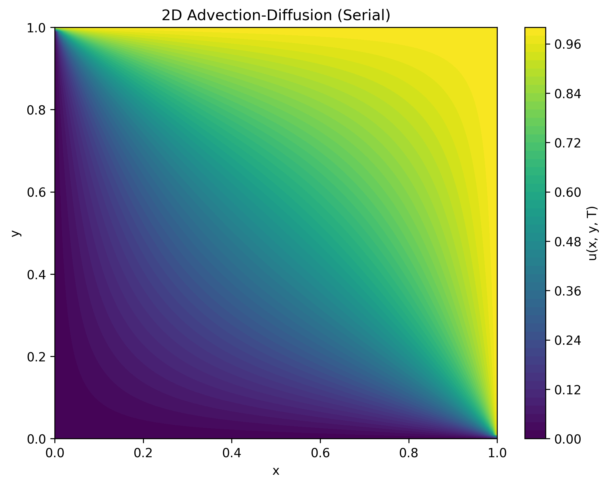
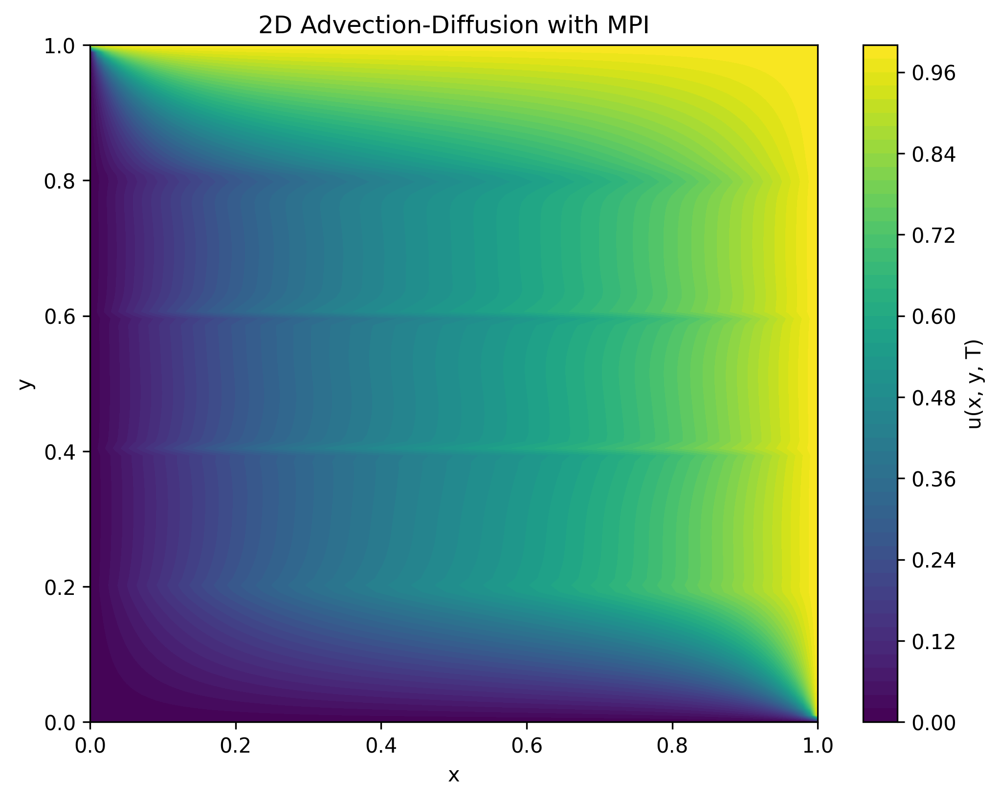

# Advection-Diffusion Solver: Serial & MPI Implementations

This sub repository contains two implementations of a 2D advection-diffusion solver using finite difference methods in Python:
- A **serial version**.
- A **parallel version** using MPI via `mpi4py`.

Both versions solve the same physical problem with identical numerical parameters, so their solution fields are nearly identical. The key difference lies in performance, allowing you to directly compare execution times and assess scalability.

---

## Table of Contents

- [Overview](#overview)
- [Included Files](#included-files)
- [Requirements](#requirements)
- [How to Run](#how-to-run)
- [Scalability and Performance Results](#scalability-and-performance-results)
- [Results Discussion](#results-discussion)

---

## Overview

The 2D advection-diffusion equation models the combined effects of advection (transport) and diffusion (spreading) in a  domain. In these implementations:
- **Advection velocities** are set to zero, resulting in pure diffusion.
- **Diffusion** is governed by a diffusion coefficient `D`.
- **Dirichlet boundary conditions** are applied on all sides.
- An explicit time-stepping scheme is used to advance the solution.

This repository includes:
- A **serial code** (`advDif_serial.py`) that runs on a single processor.
- A **parallel code** (`advDif_parallel.py`) that uses MPI to divide the domain among multiple processors.

Both versions output a contour plot of the final solution and report execution time, enabling a direct performance comparison.

---

## Included Files

```
CFD-Advection-Diffusion-MPI/
├── advDif_serial.py         # Serial version of the solver
├── advDif_parallel.py       # Parallel version using MPI (mpi4py)
├── README.md                
├── requirements.txt         # Dependencies (numpy, matplotlib, mpi4py)
```

---

## Requirements

The following dependencies are required for both the serial and parallel versions:

```plaintext
numpy
matplotlib
mpi4py
```

Requirement file is already created install the dependencies via:

```bash
pip install -r requirements.txt
```

---

## How to Run

### Serial Version

Run the serial version with:
```bash
python advDif_serial.py
```

### Parallel Version

Run the parallel version using `mpiexec` (ensure your MPI installation is set up correctly):
```bash
mpiexec -n 4 python advDif_parallel.py
```
You can vary the number of processors (e.g., 2, 4, 5, or 6) and adjust the grid sizes as needed.

---

## Scalability and Performance Results

The following table summarizes the execution times for the serial and parallel implementations, along with the corresponding speedup relative to the serial version:

| Configuration                          | Simulation Time (seconds) | Speedup (relative to serial) |
|----------------------------------------|---------------------------|------------------------------|
| **Serial**                             | 1346.69                   | 1.00×                        |
| **Parallel (MPI Decomposition: 1 x 2)**  | 773.87                    | 1.74×                        |
| **Parallel (MPI Decomposition: 2 x 2)**  | 442.39                    | 3.04×                        |
| **Parallel (MPI Decomposition: 1 x 5)**  | 403.66                    | 3.33×                        |

These results demonstrate that:
- The serial and parallel implementations produce identical (or nearly identical) solutions.
- The parallel version achieves significant speedup as the number of processors increases.
- Different domain decompositions (balanced vs. unbalanced) impact the overall performance and communication overhead.

---

## Solution Plots

Below are the final solution plots generated by the serial and parallel versions.

### Serial Solution
<p align="center">
  
</p>

### Parallel Solution
<p align="center">
  
</p>

---

## Results Discussion

- **Solution Consistency:**  
  Both the serial and parallel solvers yield nearly identical solution fields, verifying that the parallel implementation correctly solves the advection-diffusion equation.

- **Scalability:**  
  The parallel version shows clear performance improvements:
  - With 2 processors, the simulation is approximately 1.74× faster.
  - With 4 processors, it is approximately 3.04× faster.
  - With 5 processors, it achieves around 3.33× speedup.
  
- **MPI Decomposition Impact:**  
  The way the domain is decomposed (e.g., 1x2, 2x2, or 1x5) affects performance due to differences in communication overhead between processes. A balanced decomposition (e.g., 2x2 for 4 processors) tends to yield better scalability.

- **Performance Trade-Offs:**  
  For small grid sizes, MPI communication overhead may dominate. As the problem size increases, parallel efficiency improves and the benefits of domain decomposition become more apparent.


